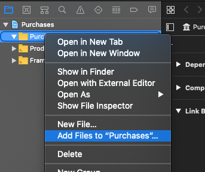
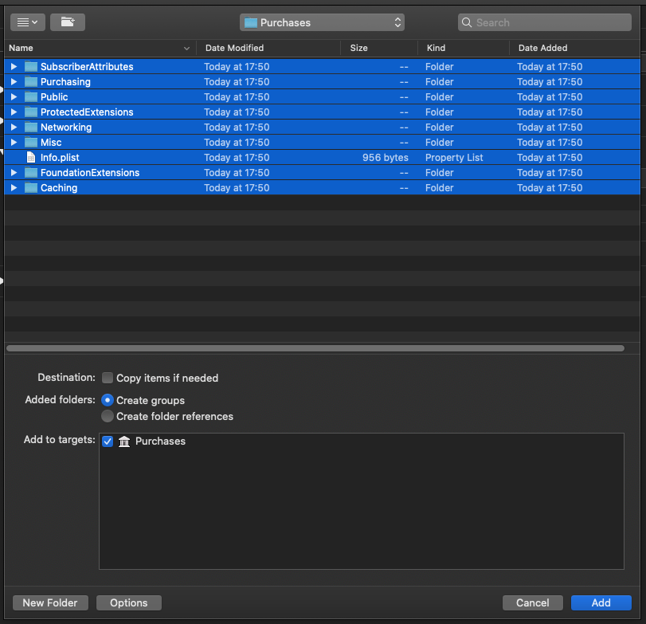

# Xamarin.RevenueCat.iOS

Xamarin.iOS Bindings for RevenueCat ([Website](https://www.revenuecat.com/), [Setup Instructions](https://docs.revenuecat.com/docs/ios)).

## NuGet Feed

### Xamarin.RevenueCat.iOS

The actual bindings.

[https://www.nuget.org/packages/Xamarin.RevenueCat.iOS/](https://www.nuget.org/packages/Xamarin.RevenueCat.iOS/)

### Xamarin.RevenueCat.iOS.Extensions

Contains extension methods for `Xamarin.RevenueCat.iOS` adding e.g. async/await convenience methods.

[https://www.nuget.org/packages/Xamarin.RevenueCat.iOS.Extensions/](https://www.nuget.org/packages/Xamarin.RevenueCat.iOS.Extensions/)

## Versioning Scheme

The versioning scheme of `Xamarin.RevenueCat.iOS` is derived from the versioning of `revenuecat/purchases-ios`.

### Example:

| revenuecat/purchases-ios | Xamarin.RevenueCat.iOS | Note |
|:--|:--|:--|
| 3.4.1 | 3.4.1.1 | First version of bindings for 3.4.1 |
| 3.4.1 | 3.4.1.17 | Bindings for 3.4.1 containing fixes |

## Troubleshooting

### unrecognized selector sent to instance

If initialization crashes and you get errors like `[RCPurchases configureSubscriberAttributesManager]: unrecognized selector sent to instance`, please adapt your project configuration:

Add `-gcc_flags "-ObjC"` to the `MtouchExtraArgs` XML element of your project file. If you want to do the config change using the UI Editor, the change is given below:

## How to bind new version

This section explains how to create resp. adapt the bindings to bind to a newer version of RevenueCat for iOS.

### Build static library

1. `cd sharpie`
2. Set the desired version of RevenueCat for iOS in `revenuecat-version.txt`
3. Execute `./prepare-library-build.sh`
4. Right click "Purchases" to add files:
	* 
5. Select everything in the "Purchases" folder, and make sure that the settings are configured as described:
	* 
6. Press "Add"
7. Close XCode
8. Execute `./finish-library-build.sh`

After these steps, a new static library was built and moved to `Xamarin.RevenueCat.iOS/nativelib/libPurchases.a`. This file is referenced as `NativeReference` in `Xamarin.RevenueCat.iOS.csproj`.

### Create C# Bindings using Objective Sharpie

This section describes how to create `ApiBindings.cs` and `StructsAndEnums.cs`.

1. `cd sharpie`
2. Set the desired version of RevenueCat for iOS in `revenuecat-version.txt`
3. Execute `./create-sharpie-files.sh`
4. Copy `ApiBindings.cs` and `StructsAndEnums.cs` to `../Xamarin.RevenueCat.iOS`

#### Tip when updating to newer version of revenuecat/purchases-ios

To find out which API changes were made between two versions of revenuecat/purchases-ios, you could execute sharpie twice:

1. Execute steps 1 to 3 from the steps above
	* Do not change the version of `revenuecat/purchases-ios` in `revenuecat-version.txt`
2. Execute `mv ApiBindings.cs ApiBindings_old.cs`
3. Execute `mv StructsAndEnums.cs StructsAndEnums_old.cs`
4. Change the version of `revenuecat/purchases-ios` in `revenuecat-version.txt`
5. Execute `./create-sharpie-files.sh`

Now you can use `diff` or your favorite diff tool to detect the changes between both versions.

## License

The license for this repository is specified in 
[LICENSE.txt](LICENSE.txt)
