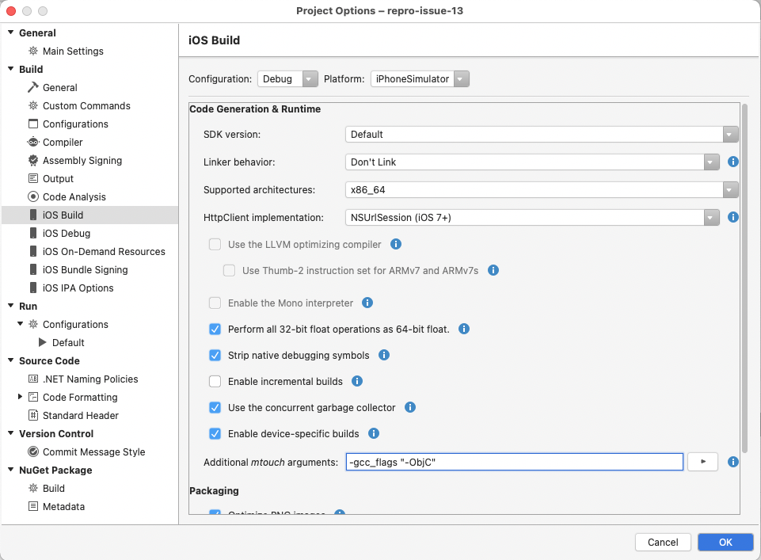

# Xamarin.RevenueCat.iOS

Xamarin.iOS Bindings for RevenueCat ([Website](https://www.revenuecat.com/), [Setup Instructions](https://docs.revenuecat.com/docs/ios)).

## NuGet Feed

### Xamarin.RevenueCat.iOS

The actual bindings.

[https://www.nuget.org/packages/Xamarin.RevenueCat.iOS/](https://www.nuget.org/packages/Xamarin.RevenueCat.iOS/)

### Xamarin.RevenueCat.iOS.Extensions

Contains extension methods for `Xamarin.RevenueCat.iOS` adding e.g. async/await convenience methods.

[https://www.nuget.org/packages/Xamarin.RevenueCat.iOS.Extensions/](https://www.nuget.org/packages/Xamarin.RevenueCat.iOS.Extensions/)

## Versioning Scheme

The versioning scheme of `Xamarin.RevenueCat.iOS` is derived from the versioning of `revenuecat/purchases-ios`.

### Example:

| revenuecat/purchases-ios | Xamarin.RevenueCat.iOS | Note |
|:--|:--|:--|
| 3.4.1 | 3.4.1.1 | First version of bindings for 3.4.1 |
| 3.4.1 | 3.4.1.17 | Bindings for 3.4.1 containing fixes |

## Troubleshooting

### unrecognized selector sent to instance

If initialization crashes and you get errors like `[RCPurchases configureSubscriberAttributesManager]: unrecognized selector sent to instance`, please adapt your project configuration:

Add `-gcc_flags "-ObjC"` to the `MtouchExtraArgs` XML element of your project file. If you want to do the config change using the UI Editor, the change is given below:

Please see [this issue](https://github.com/thisisthekap/Xamarin.RevenueCat.iOS/issues/13) for more details.

## License

The license for this repository is specified in 
[LICENSE.txt](LICENSE.txt)
